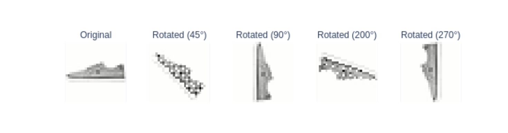
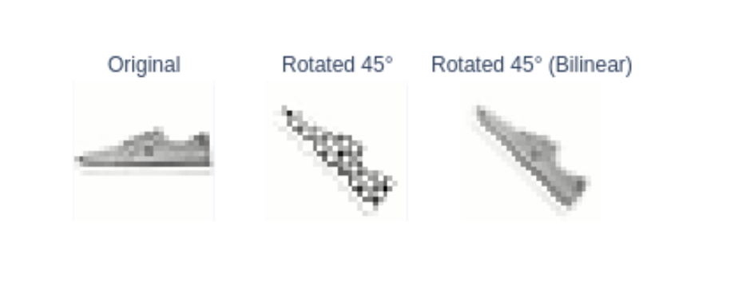
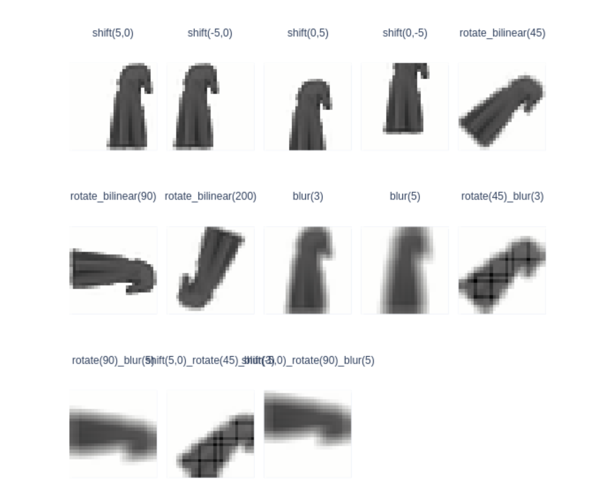
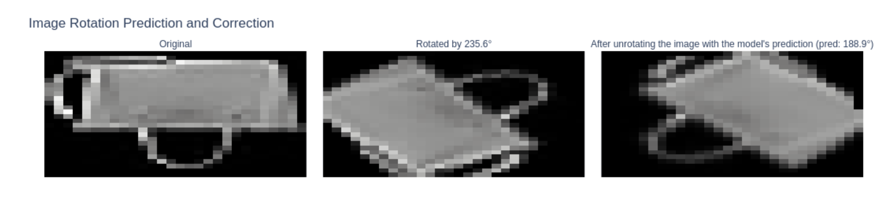

# Fashion-MNIST Rotation-Robust Classification

This project was completed as part of my machine learning coursework at UC Berkeley.

The goal of this project was not only to classify Fashion-MNIST images, but also to understand how image transformations affect model performance and how to improve robustness when test data differs from training data.

The original classifier was trained mainly on upright Fashion-MNIST images, while a later test set contained rotated images. This created a distribution shift and motivated me to explore several ways to make the classifier more robust.

---

## Project Overview

This project covers a full machine learning workflow, including:

- Image preprocessing and feature standardization
- K-means clustering and visualization
- MLP classification
- Class-wise accuracy analysis
- Confusion matrices
- Prediction confidence analysis
- Image transformations and augmentation
- Rotation matrices and linear transformations
- Bilinear interpolation
- Rotation-angle regression
- Distribution shift
- Rotation correction
- Test-time augmentation

---

## Image Transformations

I implemented several image transformations and used them to study how changes in image orientation and appearance affect classifier performance.

### Horizontal Flip

Implemented horizontal image flipping to create mirrored versions of Fashion-MNIST images.

### Image Shifting

Implemented horizontal and vertical translations while preserving the original image dimensions.

### Image Blurring

Implemented image blurring to study how losing fine visual details affects classification performance.

---

## Image Rotation with Linear Algebra

Instead of simply calling a high-level image rotation function, I implemented rotation using linear algebra.

For every pixel, I first moved the coordinate system so that the center of the image became the origin.

The 2D rotation uses the following matrix:

```text
| x' |   | cos(theta)  -sin(theta) | | x |
| y' | = | sin(theta)   cos(theta) | | y |
```

After rotating the coordinates, I translated them back into the original image coordinate system.

A Fashion-MNIST image contains:

```text
28 x 28 = 784 pixels
```

so each image can also be represented as a 784-dimensional vector.

I constructed a transformation matrix with shape:

```text
784 x 784
```

so that the transformation can be viewed conceptually as:

```text
rotated_image = transformation_matrix × original_image
```

This helped me connect image processing with several linear algebra concepts:

- Rotation matrices
- Coordinate translation
- Linear transformations
- Matrix-vector multiplication
- Flattened vector representations
- Pixel index mapping

### Rotation Examples



*Original Fashion-MNIST image compared with rotations at 45°, 90°, 200°, and 270°.*

---

## Bilinear Interpolation

A basic rotation creates gaps and visual artifacts because transformed coordinates do not always land exactly on integer pixel positions.

To improve the rotated images, I implemented bilinear interpolation.

Instead of copying the value from only one nearby pixel, bilinear interpolation estimates a new pixel value using four neighboring pixels.

Conceptually:

```text
new pixel value
    =
weighted contribution from
    top-left
    + top-right
    + bottom-left
    + bottom-right
```

This produces smoother images and reduces the gaps caused by direct pixel mapping.



*Comparison of the original image, basic 45° rotation, and 45° rotation using bilinear interpolation.*

---

## Transformation Composition and Data Augmentation

I also created multiple forms of image augmentation and combined different transformations.

Examples included:

- Horizontal shifting
- Vertical shifting
- Rotation
- Bilinear rotation
- Blur
- Rotation followed by blur
- Multiple transformations applied sequentially

This helped me understand that transformation order matters and that several simple transformations can be combined into a more complex augmentation pipeline.



*Examples of shifting, bilinear rotation, blurring, and composed transformations.*

---

## Classification Model

I trained a multilayer perceptron classifier on Fashion-MNIST using scikit-learn.

My classification workflow included:

- Train/test splitting
- Feature standardization with `StandardScaler`
- MLP classifier training
- Prediction
- Overall accuracy evaluation
- Class-wise accuracy analysis
- Confusion matrix analysis
- Prediction-confidence analysis

I also examined which Fashion-MNIST classes were easier to classify and which classes were frequently confused with each other.

---

# Handling Rotated Test Images

The most interesting challenge appeared when I evaluated the classifier on a new test set.

The training images were mostly upright, while the new test images were rotated.

This created a distribution shift:

> The model was trained on one image distribution but evaluated on another.

I explored three different approaches to solve this problem.

---

## Solution 1: Rotation-Augmented Training

The first approach was to make the training data more diverse.

I generated rotated versions of training images and added them to the training set before retraining the classifier.

### Pseudocode

```text
FOR each training image:

    choose a rotation angle

    rotate the image

    add the rotated image
    to the augmented training set

TRAIN classifier on:
    original images
    + rotated images
```

The idea was to expose the classifier to many orientations during training so that it would become less sensitive to rotation.

---

## Solution 2: Predict and Undo the Rotation

The second approach treated image rotation as a regression problem.

I trained another model whose job was to predict the rotation angle of an image.

For each rotated test image:

1. Predict its rotation angle
2. Rotate the image in the opposite direction
3. Standardize the corrected image
4. Classify the corrected image

### Pseudocode

```text
predicted_angle =
    rotation_model(image)

corrected_image =
    rotate(
        image,
        -predicted_angle
    )

standardized_image =
    scaler(corrected_image)

prediction =
    classifier(standardized_image)
```



*Example of the rotation-correction pipeline: original image, rotated image, and the image after applying the model's predicted correction.*

The goal was to transform the rotated test image back toward the distribution that the original classifier had seen during training.

---

## Rotation Regression

To support rotation correction, I trained a regression model to estimate image rotation angles.

The regression model was evaluated using:

- Mean Absolute Error (MAE)
- Mean Squared Error (MSE)
- Root Mean Squared Error (RMSE)
- R²
- Predicted vs. true rotation-angle comparisons

This regression model later became an important part of both rotation correction and test-time augmentation.

---

## Solution 3: Test-Time Augmentation

The third approach was the most interesting part of the project for me.

A predicted rotation angle is not always perfectly accurate.

Instead of trusting one predicted angle, I designed a search process that examines several possible corrections around the initial prediction.

The strategy was:

1. Predict an initial rotation angle
2. Perform a coarse search over several rotation offsets
3. Correct the image using each candidate angle
4. Predict the residual rotation of each corrected image
5. Find the most promising correction regions
6. Perform a finer local search around those regions
7. Classify all locally corrected images
8. Compare classifier confidence
9. Use the highest-confidence prediction as the final result

The overall process can be summarized as:

```text
Initial rotation prediction
            ↓
     Coarse angle search
            ↓
  Residual rotation check
            ↓
 Select promising regions
            ↓
      Fine local search
            ↓
 Classifier probabilities
            ↓
Highest-confidence prediction
```

### Pseudocode

```text
predicted_angle =
    rotation_model(image)

candidate_offsets =
    generate_coarse_offsets()

results = []

FOR each offset:

    corrected_image =
        rotate(
            image,
            -predicted_angle + offset
        )

    residual_angle =
        rotation_model(corrected_image)

    SAVE:
        offset
        absolute residual angle

SELECT the best candidate regions
with the smallest residual rotation

GENERATE finer offsets
around those regions

FOR each local offset:

    create corrected image

    standardize corrected image

    get classifier probabilities

SELECT the candidate with
the highest classification confidence

RETURN its predicted class
```

This approach combines two different signals:

- The rotation-regression model estimates how close an image is to an upright orientation
- The classifier measures how confident it is about the clothing class

Instead of relying on one estimated correction, the method searches several plausible orientations and uses classification confidence to make the final decision.

---

## Coarse-to-Fine Search

My test-time augmentation strategy used a two-stage search rather than testing every possible rotation angle at the same resolution.

### Stage 1: Coarse Search

The algorithm first explores rotation offsets with a larger step size.

```text
0°
+4°
-4°
+8°
-8°
...
```

For each candidate, the rotation model estimates the remaining rotation.

Candidates with smaller residual rotation are considered more promising.

### Stage 2: Local Refinement

After finding the best regions, the algorithm searches those regions again using smaller angle increments.

```text
Best coarse region
        ↓
Search nearby angles
with smaller steps
        ↓
Generate corrected images
        ↓
Compare classifier confidence
```

This reduces unnecessary search while still exploring precise corrections near the most promising angles.

---

## Model Evaluation

Throughout the project, I used several evaluation methods for both classification and regression.

### Classification

- Overall accuracy
- Class-wise accuracy
- Confusion matrices
- Prediction confidence

### Regression

- MAE
- MSE
- RMSE
- R²
- Predicted vs. true rotation angles

I also compared the three strategies for handling rotated test data:

```text
1. Rotation-Augmented Training

2. Rotation Prediction + Correction

3. Test-Time Augmentation
```

---

## Algorithm Highlights

The examples below are simplified pseudocode representing the main ideas I implemented.

### Rotation Transformation

```text
INPUT:
    image
    rotation angle theta

CREATE:
    transformation matrix T

FOR every source pixel:

    move pixel coordinates
    relative to image center

    APPLY:

        x_rot =
            cos(theta) * x
            - sin(theta) * y

        y_rot =
            sin(theta) * x
            + cos(theta) * y

    move rotated coordinates
    back to image coordinates

    IF output position
    is inside the image:

        map source pixel
        to output pixel

RETURN transformation matrix
```

### Bilinear Rotation

```text
FOR each transformed pixel:

    find surrounding
    source coordinates

    identify four neighbors:

        top-left
        top-right
        bottom-left
        bottom-right

    calculate distance-based weights

    output_pixel =
          weight_1 * top-left
        + weight_2 * top-right
        + weight_3 * bottom-left
        + weight_4 * bottom-right
```

### Rotation Correction

```text
predicted_angle =
    rotation_model(image)

corrected_image =
    rotate(
        image,
        -predicted_angle
    )

prediction =
    classifier(corrected_image)
```

### Test-Time Augmentation

```text
estimate initial rotation

perform coarse correction search

measure residual rotation
for each candidate

select the most promising regions

perform finer local search

classify all corrected candidates

compare prediction confidence

return highest-confidence class
```

---

## Technologies & Concepts

- Python
- NumPy
- pandas
- scikit-learn
- Matplotlib
- Plotly
- Google Colab
- Fashion-MNIST
- K-means Clustering
- MLP Classification
- Regression
- StandardScaler
- Image Augmentation
- Rotation Matrices
- Transformation Matrices
- Coordinate Transformations
- Linear Transformations
- Matrix-Vector Multiplication
- Bilinear Interpolation
- Classification Confidence
- Distribution Shift
- Rotation Regression
- Rotation Correction
- Test-Time Augmentation
- Coarse-to-Fine Search
- Model Evaluation

---

## What I Learned

This project helped me understand that good model performance depends not only on the model architecture, but also on the relationship between the training and test distributions.

A classifier that performs well on upright Fashion-MNIST images can perform much worse when the same types of images are rotated.

I explored three different ways to handle this problem:

1. Make the training data more diverse
2. Transform the test data back toward the training distribution
3. Search over multiple possible transformations during inference

The image rotation section also helped me connect linear algebra directly to image processing.

Instead of thinking of rotation as only a library function, I worked with:

- Coordinate systems
- Rotation matrices
- Transformation matrices
- Matrix-vector multiplication
- Pixel mappings
- Interpolation

The test-time augmentation section was especially interesting to me because it showed that improving prediction accuracy does not always require retraining the classifier.

The inference process itself can also be made more robust by combining multiple models, searching over possible transformations, and using model confidence to select the final prediction.

---

## Course Context

This project was completed as part of my machine learning coursework at UC Berkeley.

The course framework, dataset setup, and assignment structure were provided as part of the course.

This repository focuses on documenting the techniques I implemented, the experiments I performed, and the ideas I explored rather than publishing the original course solution.
